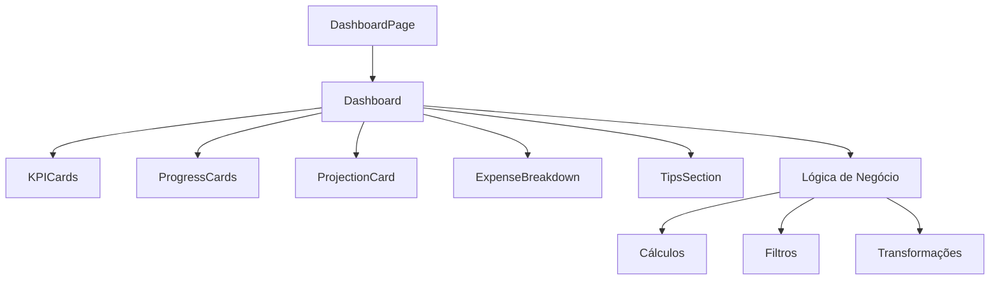

# Arquitetura do Dashboard

## Visão Geral

O Dashboard foi refatorado para seguir o princípio de **Single Responsibility** e **Composição**, dividindo um componente monolítico de 325 linhas em 5 componentes menores e focados.

## Estrutura de Componentes

### 📊 **Dashboard.jsx** (Principal)
- **Responsabilidade**: Orquestração e lógica de negócio
- **Linhas**: ~120 (redução de 63%)
- **Função**: Coordena os sub-componentes e gerencia cálculos complexos

### 🎯 **KPICards.jsx**
- **Responsabilidade**: Exibição das métricas principais
- **Linhas**: ~70
- **Função**: Renderiza os 4 cards de KPI (Gastos, Aportes, Taxa de Poupança, Progresso da Meta)

### 📈 **ProgressCards.jsx**
- **Responsabilidade**: Cards de progresso e metas
- **Linhas**: ~90
- **Função**: Meta de Aportes e Teto de Gastos com barras de progresso

### 🔮 **ProjectionCard.jsx**
- **Responsabilidade**: Projeção financeira
- **Linhas**: ~35
- **Função**: Exibe projeção de 12 meses baseada em aportes médios

### 📋 **ExpenseBreakdown.jsx**
- **Responsabilidade**: Análise de gastos por categoria
- **Linhas**: ~65
- **Função**: Visualização de distribuição de gastos com barra de progresso

### 💡 **TipsSection.jsx**
- **Responsabilidade**: Dicas financeiras dinâmicas
- **Linhas**: ~50
- **Função**: Exibe dicas contextuais baseadas no comportamento do usuário

## Benefícios da Refatoração

### 🧹 **Manutenibilidade**
- **Antes**: 1 arquivo com 325 linhas
- **Depois**: 6 arquivos com média de 70 linhas cada
- **Resultado**: Código mais fácil de entender e modificar

### 🔄 **Reutilização**
- **Antes**: Componentes acoplados
- **Depois**: Componentes independentes e reutilizáveis
- **Resultado**: Possibilidade de usar componentes em outras páginas

### 🧪 **Testabilidade**
- **Antes**: Testes complexos para componente monolítico
- **Depois**: Testes unitários para cada componente
- **Resultado**: Cobertura de testes mais eficiente

### ⚡ **Performance**
- **Antes**: Re-renderização de todo o Dashboard
- **Depois**: Re-renderização apenas dos componentes afetados
- **Resultado**: Melhor performance com React.memo

## Padrões Implementados

### 🎯 **Single Responsibility Principle**
Cada componente tem uma única responsabilidade bem definida.

### 🧩 **Composition over Inheritance**
O Dashboard principal compõe os sub-componentes em vez de herdar funcionalidades.

### 📦 **Props Interface**
Cada componente recebe apenas as props necessárias para sua função.

### 🎨 **Consistent Styling**
Todos os componentes seguem o mesmo padrão visual e de animação.

## Estrutura de Arquivos

```
src/components/
├── Dashboard.jsx                 # Componente principal
└── dashboard/                   # Sub-componentes
    ├── KPICards.jsx            # Métricas principais
    ├── ProgressCards.jsx       # Cards de progresso
    ├── ProjectionCard.jsx      # Projeção financeira
    ├── ExpenseBreakdown.jsx    # Análise de gastos
    └── TipsSection.jsx         # Dicas financeiras
```

## Fluxo de Dados



## Animações

Todos os componentes mantêm as animações originais:
- **KPICards**: Delay escalonado (0.1s, 0.2s, 0.3s, 0.4s)
- **ProgressCards**: Delay 0.5s e 0.6s
- **ProjectionCard**: Delay 0.7s
- **ExpenseBreakdown**: Delay 0.8s
- **TipsSection**: Delay 0.9s + animações internas

## Manutenção

### Adicionando Novos KPIs
1. Edite `KPICards.jsx`
2. Adicione novo item ao array `kpiData`
3. Configure ícone, cor e delay

### Modificando Dicas
1. Edite `TipsSection.jsx`
2. Ajuste a função `getIcon()` se necessário
3. Modifique a lógica de renderização

### Criando Novos Cards
1. Crie novo componente em `src/components/dashboard/`
2. Importe no `Dashboard.jsx`
3. Adicione ao JSX com animação apropriada

## Próximos Passos

1. **Testes Unitários**: Criar testes para cada componente
2. **Storybook**: Documentar componentes visualmente
3. **Performance**: Implementar lazy loading se necessário
4. **Acessibilidade**: Melhorar suporte a screen readers
